# UMA (User Management Automation)

IAMユーザー毎に登録できるCodeCommit用のSSHキーを利用して、実行中のEC2インスタンスにSSH経由でアクセスできるようにします。

## 作成した動機

プロジェクトへの人の出入り時のたびに、EC2へのSSH公開鍵の設置及び削除作業が発生し、かなりの作業時間を取られている。
特にオートスケーリング構成のEC2については、AMI再取得,起動テンプレートの更新が発生するため非常に面倒である。

そのため極力自動化したい。
AMIの再取得もダルいので、EC2起動時、およびcronで定期的にユーザーや公開鍵を同期したい。

## 機能



- 同期したいIAMグループ名を引数にして実行します。

### ユーザー同期

- (ユーザー作成)指定したIAMグループに所属しているIAMユーザーがインポートされ、ローカルLinuxユーザーが作成されます。なお作成したLinuxユーザーのコメント欄に文字列`ManagedByUMA`を設定します。
- (所属グループアタッチ)作成したLinuxユーザーに、指定したIAMグループと同名のLinuxグループをセカンダリーグループとしてアタッチします。
- (ユーザー削除)コメント欄に文字列`ManagedByUMA`が設定されているLinuxユーザー名が、指定したIAMグループにIAMユーザーとして所属していなければ、Linuxユーザーを削除します。


## 前提条件

### IAM権限

UMAを実行するにあたり以下のポリシーが必要になります。

```json
```


### IAMグループ

指定したIAMグループが存在する必要があります。存在しない場合、そのグループはi無視されます。

### Linuxグループ

指定したIAMグループ名と同じ名前のLinuxグループが、ローカルシステムに存在する必要があります。存在しない場合、そのグループは処理対象外となります。

### SSH公開鍵

同期したいIAMユーザーは、CodeCommit用のSSHキーが登録されている必要があります。存在しない場合、そのIAMユーザーは無視されます。

## IAMユーザー名とLinuxユーザー名

IAMユーザー名に使用できる文字は次のとおりです。
>英数字。次の一般的な文字を含みます：プラス（+）、等しい（=）、コンマ（、）、ピリオド（。）、アット（@）、アンダースコア（_）、およびハイフン（-）。

Linuxユーザー名に使用できる文字は次のとおりです（POSIX（ "Portable Operating System Interface for Unix"）標準（IEEE標準1003.1 2008））：
>英数字。次の一般的な文字を含みます：ピリオド（。）、アンダースコア（_）、およびハイフン（-）。

したがって、IAMユーザー名では許可されているが、Linuxユーザー名では許可されていない文字は次のとおりです。
>プラス（+）、等しい（=）、コンマ（、）、（@）。

UMAでは、Linuxユーザーを作成するときに、これらの特殊文字に対して次のマッピングを使用します。
* `+` => `plus`
* `=` => `equal`
* `、` => `comma`

また`@`については、@以降(@を含む)の文字列を削除します。

したがってSSHでログインする場合は、`name+123@email.com`の代わりに` nameplus123`を使用する必要があります。

Linuxユーザー名の長さは最大32文字です。


## 注意事項
- EC2インスタンスは、インターネットゲートウェイ+パブリックIPまたはNat Gatetway /インスタンスのいずれかを介してAWSAPIにアクセスする必要があります。
- IAMユーザーのssh公開鍵を削除しても、ユーザーがすでにログインしている場合、SSHセッションは閉じられません。
- 複数のサーバーにまたがるuidとgidが正しく整列しない場合があります（UMAがいつ実行されたか、およびその時点でどのユーザーが存在していたかが原因です）。その結果NFSマウントまたはAmazonEFSに影響を与える可能性がありますので注意してください。
- UMAは最大100のIAMユーザーで機能します。